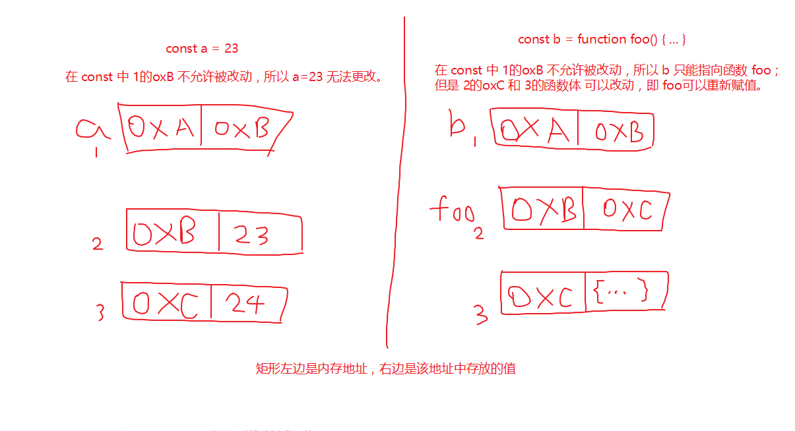

# ES6新特性

## 1. let和const命令

### var的问题

* 没有块级作用域。
* 存在变量提升。
* 变量可以重复声明。

```javascript
var a = [];
for (let i = 0; i < 10; i++) {
  a[i] = function () {
    console.log(i);
  };
}
a[6](); // 6
```

### let

* 存在块级作用域，使用大括号包裹可手动产生块级作用域。
* 不存在变量提升。
* 暂时性死区：在代码块内，使用 let 声明变量之前，该变量不可用。
* 不允许在相同作用域内，重复声明同一个变量。

### const

* 声明一个只读的常量：常量的值（此处值指非对象类型）（常量所指向的内存地址）不允许改动；但是如果常量的值是对象类型，那么该对象（常量指向存放 _存放对象的内存地址_ 的内存地址）是允许改动的。



* 其余特性同 let。

## 2. 变量的解构赋值

> 使用一条语句从数组和对象中提取值，对变量进行赋值，这被称为解构。

### 共有特征

* 声明和赋值不能分开，必须在一条语句内完成。
* 等号右边必须是可遍历的结构，即数组或对象。
* 等号两边的结构（模式）需一致（粒度可不一致），数组对应数组，对象对应对象。
* 数组的元素是按次序排列的，变量的取值由它的位置决定；而对象的属性没有次序，变量必须与属性同名，才能取到正确的值。
* 允许指定默认值。
* 可嵌套对象（数组是特殊的对象）。

### 数组的解构赋值

等号左边的模式，完全匹配等号右边。

```javascript
let [a,b,c] = [1,2,3]
a // 1
b // 2
c // 3

let [foo, [[bar], baz]] = [1, [[2], 3]];
foo // 1
bar // 2
baz // 3

let [x, , y] = [1, 2, 3];
x // 1
y // 3

let [x, y, ...z] = ['a'];
x // "a"
y // undefined
z // []
```

如果解构不成功，变量的值就等于`undefined`。

```javascript
let [foo] = [];
foo // undefined

let [bar, foo] = [1];
bar // 1
foo // undefined
```

等号左边的模式，只匹配一部分的等号右边的数组。这种情况下，解构依然可以成功，称为不完全解构。

```javascript
let [x, y] = [1, 2, 3];
x // 1
y // 2

let [a, [b], d] = [1, [2, 3], 4];
a // 1
b // 2
d // 4

let [a, [,b], c] = [1, [2, [3, 4]], 5];
a // 1
b // [3, 4]
c // 5
```

### 对象的解构赋值

数组的元素是按次序排列的，变量的取值由它的位置决定；而对象的属性没有次序，变量必须与属性 **同名**，才能取到正确的值。

```javascript
let { bar, foo } = { foo: 'aaa', bar: 'bbb' };
foo // "aaa"
bar // "bbb"

let { baz } = { foo: 'aaa', bar: 'bbb' };
baz // undefined
```

对象的解构赋值，可以很方便地将现有对象的方法，赋值到某个变量。

```javascript
// 例一
let { sin, cos } = Math;

// 例二
const { log } = console;
log('hello') // hello
```

如果变量名与属性名不一致，必须写成下面这样。

对象的解构赋值的 **内部机制**，是先找到同名属性，然后再赋给对应的变量。真正被赋值的是后者（变量），而不是前者（模式）。

```javascript
let { foo: baz } = { foo: 'aaa', bar: 'bbb' };
baz // "aaa"

let obj = { first: 'hello', last: 'world' };
let { first: f, last: l } = obj;
f // 'hello'
l // 'world'

// 两者等同
let { bar, foo } = { foo: 'aaa', bar: 'bbb' }; // 简写
let { bar: bar, foo: foo } = { foo: 'aaa', bar: 'bbb' }; // 完整写法
```

### 字符串的解构赋值

字符串也可以解构赋值。这是因为此时，字符串被转换成了一个类似数组的对象。

```javascript
const [a, b, c, d, e] = 'hello';
a // "h"
b // "e"
c // "l"
d // "l"
e // "o"
```

类似数组的对象都有一个`length`属性，因此还可以对这个属性解构赋值。

```javascript
let {length : len} = 'hello';
len // 5
```

### 数值和布尔值的解构赋值

解构赋值时，如果等号右边是数值和布尔值，则会先转为对象。

```javascript
let {toString: s} = 123;
s === Number.prototype.toString // true

let {toString: s} = true;
s === Boolean.prototype.toString // true
```

上面代码中，数值和布尔值的 **包装对象** 都有`toString`属性，因此变量`s`都能取到值。

解构赋值的规则是，只要等号右边的值不是对象或数组，就先将其转为对象。由于`undefined`和`null`无法转为对象，不是可遍历解构，所以对它们进行解构赋值，都会报错。

```javascript
let { prop: x } = undefined; // TypeError
let { prop: y } = null; // TypeError
```

### 函数参数的解构赋值

```javascript
function add([x, y]){
  return x + y;
}

add([1, 2]); // 3
```

### 用途

变量的解构赋值用途很多。

**（1）交换变量的值**

```javascript
let x = 1;
let y = 2;

[x, y] = [y, x];
```

上面代码交换变量`x`和`y`的值，这样的写法不仅简洁，而且易读，语义非常清晰。

**（2）从函数返回多个值**

函数只能返回一个值，如果要返回多个值，只能将它们放在数组或对象里返回。有了解构赋值，取出这些值就非常方便。

```javascript
// 返回一个数组

function example() {
  return [1, 2, 3];
}
let [a, b, c] = example();

// 返回一个对象

function example() {
  return {
    foo: 1,
    bar: 2
  };
}
let { foo, bar } = example();
```

**（3）函数参数的定义**

解构赋值可以方便地将一组参数与变量名对应起来。

```javascript
// 参数是一组有次序的值
function f([x, y, z]) { ... }
f([1, 2, 3]);

// 参数是一组无次序的值
function f({x, y, z}) { ... }
f({z: 3, y: 2, x: 1});
```

**（4）提取 JSON 数据**

解构赋值对提取 JSON 对象中的数据，尤其有用。

```javascript
let jsonData = {
  id: 42,
  status: "OK",
  data: [867, 5309]
};

let { id, status, data: number } = jsonData;

console.log(id, status, number);
// 42, "OK", [867, 5309]
```

上面代码可以快速提取 JSON 数据的值。

**（5）函数参数的默认值**

```javascript
jQuery.ajax = function (url, {
  async = true,
  beforeSend = function () {},
  cache = true,
  complete = function () {},
  crossDomain = false,
  global = true,
  // ... more config
} = {}) {
  // ... do stuff
};
```

指定参数的默认值，就避免了在函数体内部再写`var foo = config.foo || 'default foo';`这样的语句。

**（6）遍历 Map 结构**

任何部署了 Iterator 接口的对象，都可以用`for...of`循环遍历。Map 结构原生支持 Iterator 接口，配合变量的解构赋值，获取键名和键值就非常方便。

```javascript
const map = new Map();
map.set('first', 'hello');
map.set('second', 'world');

for (let [key, value] of map) {
  console.log(key + " is " + value);
}
// first is hello
// second is world
```

如果只想获取键名，或者只想获取键值，可以写成下面这样。

```javascript
// 获取键名
for (let [key] of map) {
  // ...
}

// 获取键值
for (let [,value] of map) {
  // ...
}
```

**（7）输入模块的指定方法**

加载模块时，往往需要指定输入哪些方法。解构赋值使得输入语句非常清晰。

```javascript
const { SourceMapConsumer, SourceNode } = require("source-map");
```

## 3. 字符串的扩展

### 新增的方法

**（1）startWith\(\)**

`startsWith()` 方法用来判断当前字符串是否以另外一个给定的子字符串开头（大小写敏感），并根据判断结果返回 `true` 或 `false`。

```javascript
const str = 'Saturday night plans';

// str是否以 Sat 开头
console.log(str.startsWith('Sat')); // true

// str从第三个字符位置开始算，是否以 Sat 开头
console.log(str.startsWith('Sat', 3)); // false
```

**（2）endWith\(\)**

`endsWith()`方法用来判断当前字符串是否是以另外一个给定的子字符串“结尾”的（大小写敏感），根据判断结果返回 `true` 或 `false`。

```javascript
const str1 = 'Cats are the best!';
// 设置str1长度为17，其是否以 best 结尾
console.log(str1.endsWith('best', 17)); // true

const str2 = 'Is this a question';
// str2是否以 ？ 结尾
console.log(str2.endsWith('?')); // false
```

### 字符串模版

## 4. 数组的扩展

### 新增的方法

**（1）map\(\)**

`map()` 方法创建一个新数组，其结果是该数组中的每个元素是调用一次提供的函数后的返回值。

```javascript
// 格式化数组中的对象
var kvArray = [{key: 1, value: 10}, 
               {key: 2, value: 20}, 
               {key: 3, value: 30}];

var reformattedArray = kvArray.map(function(obj) { 
   var rObj = {};
   rObj[obj.key] = obj.value;
   return rObj;
});

// reformattedArray 数组为： [{1: 10}, {2: 20}, {3: 30}], 

// kvArray 数组未被修改: 
// [{key: 1, value: 10}, 
//  {key: 2, value: 20}, 
//  {key: 3, value: 30}]
```

**（2）reduce\(\)**

`reduce`为数组中的每一个元素依次执行`callback`函数，不包括数组中被删除或从未被赋值的元素，接受四个参数：

* `accumulator 累计器`
* `currentValue 当前值`
* `currentIndex 当前索引`
* `array 数组`

回调函数第一次执行时，`accumulator` 和`currentValue`的取值有两种情况：如果调用`reduce()`时提供了`initialValue`，`accumulator`取值为`initialValue`，`currentValue`取数组中的第一个值；如果没有提供 `initialValue`，那么`accumulator`取数组中的第一个值，`currentValue`取数组中的第二个值。

**注意：**如果没有提供`initialValue`，reduce 会从索引1的地方开始执行 callback 方法，跳过第一个索引。如果提供`initialValue`，从索引0开始。

```javascript
// 求和
var sum = [0, 1, 2, 3].reduce(function (accumulator, currentValue) {
  return accumulator + currentValue;
}, 0);
// 和为 6
```

**（3）filter\(\)**

将所有在过滤函数中返回 true 的数组元素放进一个新数组中并返回。

```javascript
// 创建了一个新数组，该数组的元素由原数组中值大于 10 的元素组成
function isBigEnough(element) {
  return element >= 10;
}
var filtered = [12, 5, 8, 130, 44].filter(isBigEnough);
// filtered is [12, 130, 44]
```

**（4）forEach\(\)**

`forEach()` 方法对数组的每个元素执行一次回调函数。可依次向 `callback` 函数传入三个参数：

1. 数组当前项的值
2. 数组当前项的索引
3. 数组对象本身

`forEach()` 为每个数组元素执行一次 `callback` 函数；与 [`map()`](https://developer.mozilla.org/zh-CN/docs/Web/JavaScript/Reference/Global_Objects/Array/map) 或者 [`reduce()`](https://developer.mozilla.org/zh-CN/docs/Web/JavaScript/Reference/Global_Objects/Array/reduce) 不同的是，它总是返回 [`undefined`](https://developer.mozilla.org/zh-CN/docs/Web/JavaScript/Reference/Global_Objects/undefined) 值，并且不可链式调用。

```javascript
const items = ['item1', 'item2', 'item3'];
const copy = [];
items.forEach(function(item){
  copy.push(item);
});
```

## 5. 正则的扩展

## 6. 数值的扩展

## 7. 函数的扩展

### 参数默认值

ES6 之前给函数参数指定默认值的做法：

```javascript
function log(x, y) {
  y = y || 'World';
  console.log(x, y);
}

log('Hello') // Hello World
log('Hello', 'China') // Hello China
// 空字符串对应的布尔值为 false，可采取if (typeof y === 'undefined')来判断
log('Hello', '') // Hello World
```

ES6 为函数的参数设置默认值，即直接写在参数定义的后面：

```javascript
function log(x, y = 'World') {
  console.log(x, y);
}

log('Hello') // Hello World
log('Hello', 'China') // Hello China
log('Hello', '') // Hello
```

函数形参变量是默认声明的，所以不能用 let 和 const 再次声明。

形参中参数默认值的位置应该是函数的尾参数，否则该参数实际上无法省略，因为实参和形参的位置顺序是对应的。

一旦设置了参数的默认值，函数进行声明初始化时，参数会形成一个单独的作用域（context）。等到初始化结束，这个作用域就会消失。这种语法行为，在不设置参数默认值时，是不会出现的。

### 剩余参数

> 形式为： function\(...变量名\) { };
>
> 扩展运算符： ...

剩余参数允许将不确定数量的参数表示为数组，这样就不需要使用伪数组 arguments 对象导致需要将伪数组转换成数组才能使用数组方法。

剩余参数之后不能再有其他参数，即它只能是 **最后一个参数**。

```javascript
function add(...values) {
  let sum = 0;

  for (var val of values) {
    sum += val;
  }

  return sum;
}

add(2, 5, 3) // 10
```

### 属性

**length属性**

> 含义：该函数预期传入的参数个数。

指定默认值以后，函数的 length 属性将返回指定默认值参数之前的参数个数；使用剩余参数时，同理返回扩展运算符 _..._ 之前的参数个数。这使得 length 属性失真。

```javascript
(function (a) {}).length // 1
(function (a = 5) {}).length // 0
(function (a, b, c = 5) {}).length // 2
(function(...args) {}).length // 0
(function(a,b,...args) {}).length // 2
```

**name属性**

> 含义：返回该函数的函数名。

* 具名函数

```javascript
function foo() {}
foo.name // "foo"
```

* 匿名函数

```javascript
var f = function () {};
// ES5
f.name // ""
// ES6
f.name // "f"
```

* Function构造函数

```java
(new Function).name // "anonymous"

const sum = new Function('a', 'b', 'return a + b');
sum.name // "anonymous"
```

* bind函数

```javascript
function foo() {};
foo.bind({}).name // "bound foo"

(function(){}).bind({}).name // "bound "
```

### 箭头函数

ES6 允许使用“箭头”（`=>`）定义函数。

```javascript
var f = v => v;

// 等同于
var f = function (v) {
  return v;
};
```

如果箭头函数不需要参数或需要多个参数，就使用一个圆括号代表参数部分。

```javascript
var f = () => 5;
// 等同于
var f = function () { return 5 };

var sum = (num1, num2) => num1 + num2;
// 等同于
var sum = function(num1, num2) {
  return num1 + num2;
};
```

如果箭头函数的代码块部分多于一条语句，就要使用大括号将它们括起来，并且使用`return`语句返回。

```javascript
var sum = (num1, num2) => {
    num1 += num1 + num2
    return num1
}
```

由于大括号被解释为代码块，所以如果箭头函数直接返回一个对象，必须在对象外面加上括号，否则会报错。

```javascript
// 报错
let getTempItem = id => { id: id, name: "Temp" };

// 不报错
let getTempItem = id => ({ id: id, name: "Temp" });
```

下面是一种特殊情况，虽然可以运行，但会得到错误的结果。

```javascript
let foo = () => { a: 1 };
foo() // undefined
```

上面代码中，原始意图是返回一个对象`{ a: 1 }`，但是由于引擎认为大括号是代码块，所以执行了一行语句`a: 1`。这时，`a`可以被解释为语句的标签，因此实际执行的语句是`1;`，然后函数就结束了，没有返回值。

如果箭头函数只有一行语句，且不需要返回值，可以采用下面的写法，就不用写大括号了。

```javascript
let fn = () => void doesNotReturn();
```

箭头函数可以与变量解构结合使用。

```javascript
const full = ({ first, last }) => first + ' ' + last;

// 等同于
function full(person) {
  return person.first + ' ' + person.last;
}
```

箭头函数使得表达更加简洁。

```javascript
const isEven = n => n % 2 === 0;
const square = n => n * n;
```

上面代码只用了两行，就定义了两个简单的工具函数。如果不用箭头函数，可能就要占用多行，而且还不如现在这样写醒目。

箭头函数的一个用处是简化回调函数。

```javascript
// 正常函数写法
[1,2,3].map(function (x) {
  return x * x;
});

// 箭头函数写法
[1,2,3].map(x => x * x);
```

另一个例子是

```javascript
// 正常函数写法
var result = values.sort(function (a, b) {
  return a - b;
});

// 箭头函数写法
var result = values.sort((a, b) => a - b);
```

下面是 rest 参数（剩余参数）与箭头函数结合的例子。

```javascript
const numbers = (...nums) => nums;

numbers(1, 2, 3, 4, 5)
// [1,2,3,4,5]

const headAndTail = (head, ...tail) => [head, tail];

headAndTail(1, 2, 3, 4, 5)
// [1,[2,3,4,5]]
```

注意点：

（1）函数体内的`this`对象，就是定义时所在的对象，而不是使用时所在的对象。

（2）不可以当作构造函数，也就是说，不可以使用`new`命令，否则会抛出一个错误。

（3）不可以使用`arguments`对象，该对象在函数体内不存在。如果要用，可以用 rest 参数代替。

（4）不可以使用`yield`命令，因此箭头函数不能用作 Generator 函数。

上面四点中，第一点尤其值得注意。`this`对象的指向是可变的，但是在箭头函数中，它是固定的。

## 8. 对象的扩展

## 10. Set和Map数据结构

## 13. Promise对象

## 11. async函数

## 12. Class

## 13. 模块化

